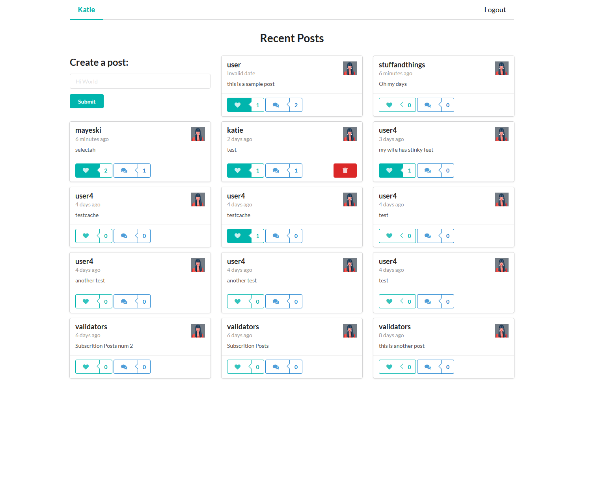
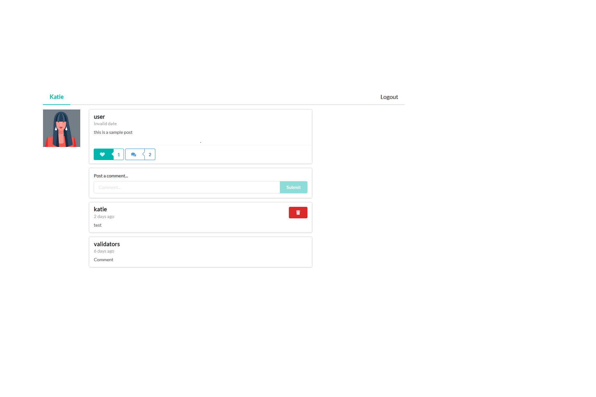

# Table of Contents

* [Title](#SocialMediaApp)
* [Motivation](#Motivation)
* [Images](#Images)
* [Live-Link](#Live-Link)
* [Skills-Used](#Skills-Used)
* [Description](#Description)
* [License](#License)

# SocialMediaApp

# Motivation

I wanted to further my understanding of building a full-stack MERN application. This project also introduced me to GraphQL and how it is used in a real world setting. I didn't expect to learn as much as I did from this project but the complexity of creating something like this is actually pretty surprising. This project also helped fortify my knowledge of JS and React pretty well which I was surprised by. Things like destructuring, useState and useContext were used quite a bit throughout this project which are very important topics to understand and while I was comfortable before with using them I feel like I understand them much better now.

# Images

</img>

* Home Page

</img>

* Comment Page

# Live-Link
[https://social-media-merng-app.herokuapp.com/](https://social-media-merng-app.herokuapp.com/)

# Skills-Used

*  Create a user account with verification thru JWT
*  Create posts
*  Delete posts that are from your account but restrict users from deleting posts other users create
*  Like/Unlike posts from other users
*  Comment on posts
*  Delete comments your account has made
*  Query database for only the fields that are required for that specific query using GraphQL
*  Store users and user data (comments, likes, etc) in a Mongoose DB
*  Link client and server side application to a Heroku deployment

# Description

The app uses the following technologies:

* [React](https://reactjs.org/) is used to run the application.
* [Semantic-UI](https://semantic-ui.com/) is used to create the user interface of the application.
* [MongoDB Atlas](https://docs.mongodb.com/manual/) is used in the backend to post and recieve inform from our database.
* [NodeJS](https://nodejs.org/en/) is used for the server side of the application.
* [Apollo-GraphQL](https://www.apollographql.com/docs/)

# License

